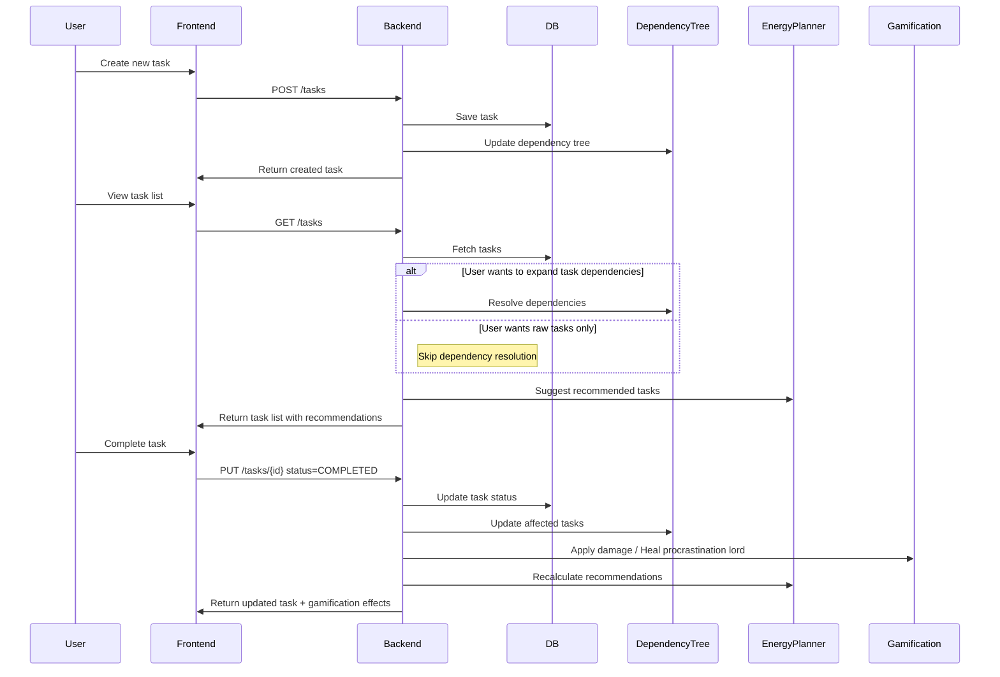

```mermaid
sequenceDiagram
    participant User
    participant Frontend
    participant Backend
    participant DB
    participant DependencyTree
    participant EnergyPlanner
    participant Gamification

    %% Task Creation
    User->>Frontend: Create new task
    Frontend->>Backend: POST /tasks
    Backend->>DB: Save task
    Backend->>DependencyTree: Update dependency tree
    Backend->>Frontend: Return created task

    %% Task Viewing
    User->>Frontend: View task list
    Frontend->>Backend: GET /tasks
    Backend->>DB: Fetch tasks
    alt User wants to expand task dependencies
        Backend->>DependencyTree: Resolve dependencies
    else User wants raw tasks only
        Note right of Backend: Skip dependency resolution
    end
    Backend->>EnergyPlanner: Suggest recommended tasks
    Backend->>Frontend: Return task list with recommendations

    %% Task Completion
    User->>Frontend: Complete task
    Frontend->>Backend: PUT /tasks/{id} status=COMPLETED
    Backend->>DB: Update task status
    Backend->>DependencyTree: Update affected tasks
    Backend->>Gamification: Apply damage / Heal procrastination lord
    Backend->>EnergyPlanner: Recalculate recommendations
    Backend->>Frontend: Return updated task + gamification effects
```