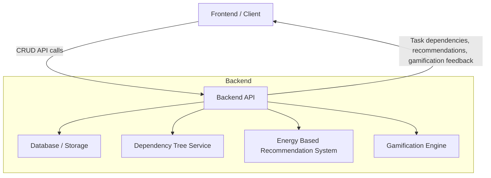

```mermaid

flowchart TD

  %% Frontend
  FE[Frontend / Client] -->|CRUD API calls| BE[Backend API]

  %% Backend modules
  subgraph Backend
      BE
      DB[Database / Storage]
      DEP[Dependency Tree Service]
      ENERGY[Energy Based Recommendation System]
      GAMIFY[Gamification Engine]
  end

  %% Backend flows
  BE --> DB
  BE --> DEP
  BE --> ENERGY
  BE --> GAMIFY

  %% Backend sends results back to frontend
  BE -->|Task dependencies, recommendations, gamification feedback| FE

```

